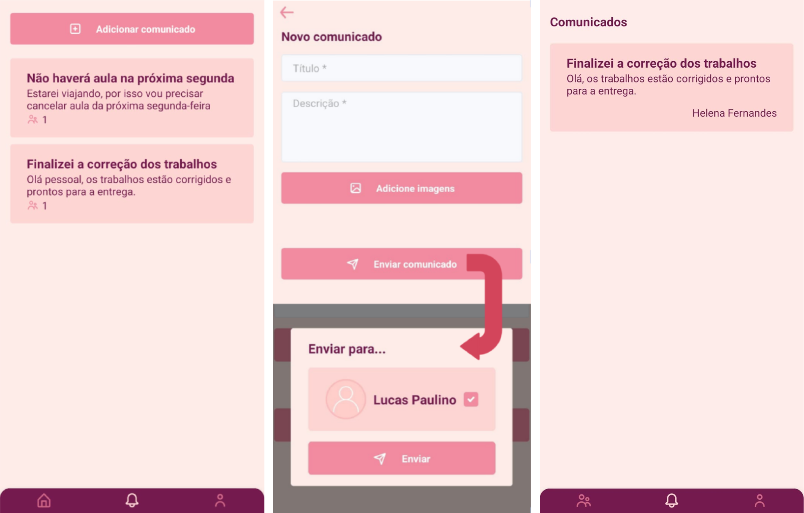

# Tarefando App

A mobile app designed for tracking and managing academic tasks, tailored to primary education and tutoring, specifically created for educators, tutors, and parents/guardians.

---

## Features

| Feature                         | Description                                                                                              |
| ------------------------------- | -------------------------------------------------------------------------------------------------------- |
| **Login**                       | Users can authenticate through a secure (JWT) login feature.                                             |
| **Tutor registration**          | Users can register as a **TUTOR**.                                                                       |
| **Guardian registration**       | Users can register as a **GUARDIAN**.                                                                    |
| **Change password**             | Users can update their passwords.                                                                        |
| **CRUD for classes**            | **TUTORS** can create, view, edit, and delete classes.                                                   |
| **CRUD for students**           | **GUARDIANS** can create, view, edit, and delete students.                                               |
| **Student linking via QR Code** | **GUARDIANS** can link their students to a class via QR code.                                            |
| **CRUD for tasks**              | Any associated user (**TUTOR** or **GUARDIAN**) can create, view, edit, and delete tasks from a student. |
| **Conclude task**               | Any associated user can mark a task as concluded.                                                        |
| **Filter tasks by status**      | Any associated user can filter student tasks by status: PENDENT, DELAYED, and CONCLUDED.                 |
| **CRUD for announcements**      | **TUTORS** can create, view, edit, and delete announcements.                                             |
| **Send announcements**          | **TUTORS** can send created announcements to **GUARDIANS** of students linked to one of their classes.   |

---

## Screens

Authentication (login, register - 1° step, register - 2° step)

**Guardian** UI (students list, new student, edit student)

**Guardian** UI - Student Details (unlinked, scanning QR Code, linked)

Task screens (new task, task details)

**Tutor** UI (classes list, new task, class details)

**Tutor** UI (announcements list, new announcement and sending of announcement);  **Guardian** UI (received announcements list)

## API

URL: https://tarefando-api.onrender.com/  
Swagger UI: https://tarefando-api.onrender.com/swagger-ui/index.html  
Repository: https://github.com/LucasPaulinoH/Tarefando-API

## Release

## License

This project is licensed under the terms of the **MIT** license.
